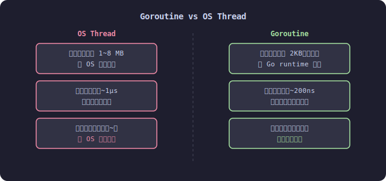
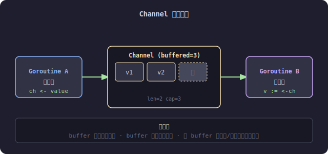
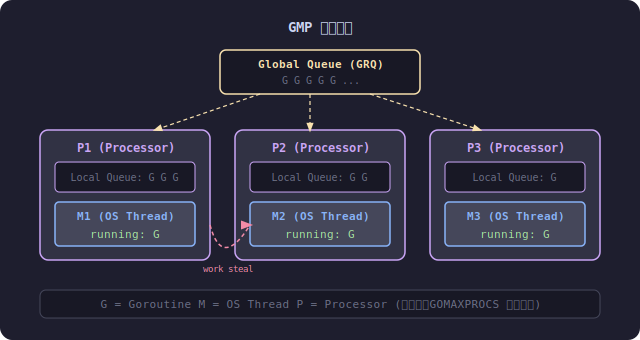

Go 的并发模型是其最核心的设计之一，口号是：

> **Do not communicate by sharing memory; instead, share memory by communicating.**

本文梳理三个核心概念：Goroutine、Channel 和 GMP 调度器。

---

## 一、Goroutine vs OS Thread

Goroutine 是 Go 运行时管理的轻量级线程，和 OS 线程相比有本质区别：



- **栈空间**：OS 线程固定分配 1~8MB 栈，Goroutine 初始仅 2KB，按需伸缩，最大可达 1GB
- **调度方式**：OS 线程由内核调度，涉及系统调用；Goroutine 由 Go runtime 在用户态调度
- **上下文切换**：线程切换约 1µs，Goroutine 切换约 200ns，快 5 倍以上
- **并发规模**：线程通常数百到数千，Goroutine 轻松跑百万级

启动一个 Goroutine 极其简单：

```go
go func() {
    fmt.Println("hello from goroutine")
}()
```

---

## 二、Channel

Channel 是 Goroutine 之间通信的管道，分为无缓冲和有缓冲两种。



### 无缓冲 Channel

发送和接收必须同时就绪，否则阻塞——天然的同步原语：

```go
ch := make(chan int)

go func() {
    ch <- 42 // 阻塞，直到有人接收
}()

v := <-ch // 阻塞，直到有人发送
fmt.Println(v) // 42
```

### 有缓冲 Channel

允许异步发送，buffer 满才阻塞：

```go
ch := make(chan int, 3)
ch <- 1 // 不阻塞
ch <- 2 // 不阻塞
ch <- 3 // 不阻塞
ch <- 4 // buffer 满，阻塞
```

### select 多路复用

同时监听多个 Channel：

```go
select {
case msg := <-ch1:
    fmt.Println("ch1:", msg)
case msg := <-ch2:
    fmt.Println("ch2:", msg)
case <-time.After(time.Second):
    fmt.Println("timeout")
}
```

---

## 三、GMP 调度模型

Go 运行时使用 GMP 模型调度 Goroutine：



三个角色：

| 角色 | 含义 | 说明 |
|------|------|------|
| **G** | Goroutine | 待执行的任务单元 |
| **M** | Machine（OS Thread） | 真正执行代码的内核线程 |
| **P** | Processor（逻辑处理器） | 调度上下文，持有本地队列 |

调度流程：

1. 新建的 G 优先放入当前 P 的 **本地队列**（Local Queue）
2. 本地队列满时，溢出到 **全局队列**（Global Queue）
3. M 必须绑定一个 P 才能执行 G
4. 当某个 P 的本地队列为空时，会从其他 P **偷取（work stealing）**一半的 G 来执行，保证负载均衡

P 的数量由 `GOMAXPROCS` 控制，默认等于 CPU 核心数：

```go
runtime.GOMAXPROCS(4) // 使用 4 个逻辑处理器
```

---

## 四、常见并发模式

### WaitGroup 等待所有 Goroutine 完成

```go
var wg sync.WaitGroup

for i := 0; i < 5; i++ {
    wg.Add(1)
    go func(id int) {
        defer wg.Done()
        fmt.Printf("worker %d done\n", id)
    }(i)
}

wg.Wait()
```

### 用 Context 控制生命周期

```go
ctx, cancel := context.WithTimeout(context.Background(), 3*time.Second)
defer cancel()

go func() {
    select {
    case <-ctx.Done():
        fmt.Println("cancelled:", ctx.Err())
    }
}()
```

---

## 总结

| 概念 | 一句话 |
|------|--------|
| Goroutine | 极轻量的并发单元，百万级无压力 |
| Channel | 通信即同步，避免共享内存竞争 |
| GMP | 用户态调度 + work stealing，榨干多核性能 |

Go 的并发不是银弹，但在 I/O 密集型和服务端场景下，这套模型的表达力和性能都极为出色。
