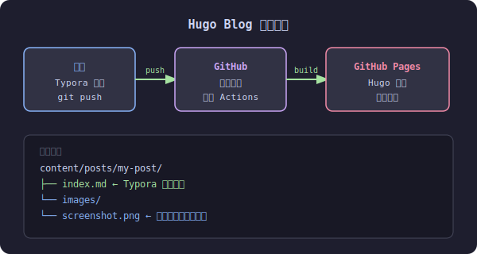

## 整体架构

本博客使用 Hugo 生成静态页面，托管在 GitHub Pages，通过 GitHub Actions 实现推送即部署。



## 技术栈

| 工具 | 用途 |
|------|------|
| Hugo | 静态站点生成器 |
| PaperMod | 博客主题 |
| GitHub Pages | 免费托管 |
| GitHub Actions | 自动构建部署 |

## 写作流程

新建一篇带图片的文章，目录结构如下：

```
content/posts/
└── 文章名/
    ├── index.md       ← 用 Typora 打开写作
    └── images/
        └── xxx.png    ← 粘贴截图自动存这里
```

Typora 偏好设置中，将图片路径配置为相对路径 `images`，粘贴截图时会自动保存到 `images/` 目录。

## 发布步骤

写完文章后，三条命令搞定发布：

```bash
git add .
git commit -m "新增文章：文章标题"
git push
```

push 后 GitHub Actions 自动触发构建，约 1 分钟后文章上线。
